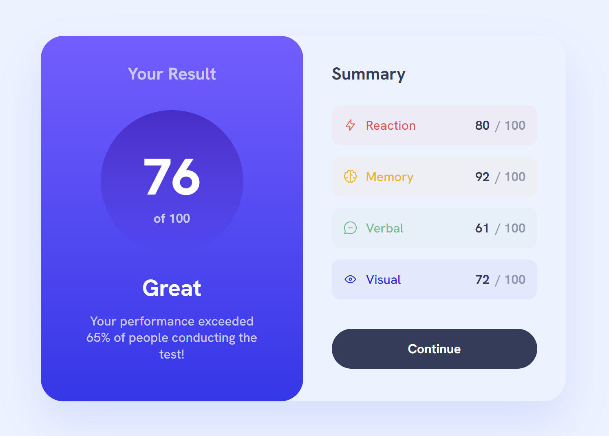
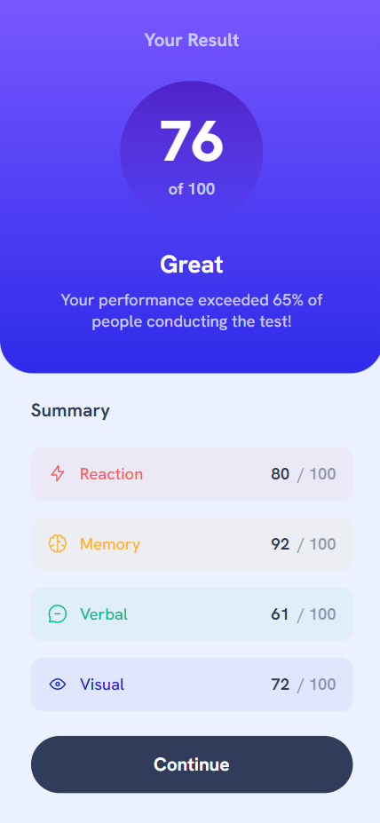

# Frontend Mentor - Results summary component solution

This is a solution to the [Results summary component challenge on Frontend Mentor](https://www.frontendmentor.io/challenges/results-summary-component-CE_K6s0maV). Frontend Mentor challenges help you improve your coding skills by building realistic projects.

### Links

- Solution URL: https://github.com/aaronrubinstein/results-summary-component
- Live Site URL: https://aaronrubinstein.github.io/results-summary-component/

### Screenshots

**Desktop**

**Mobile**

